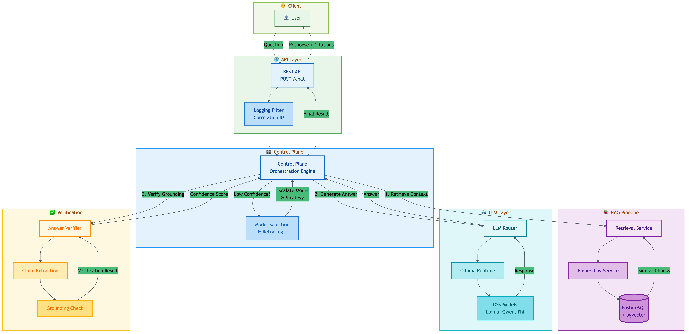
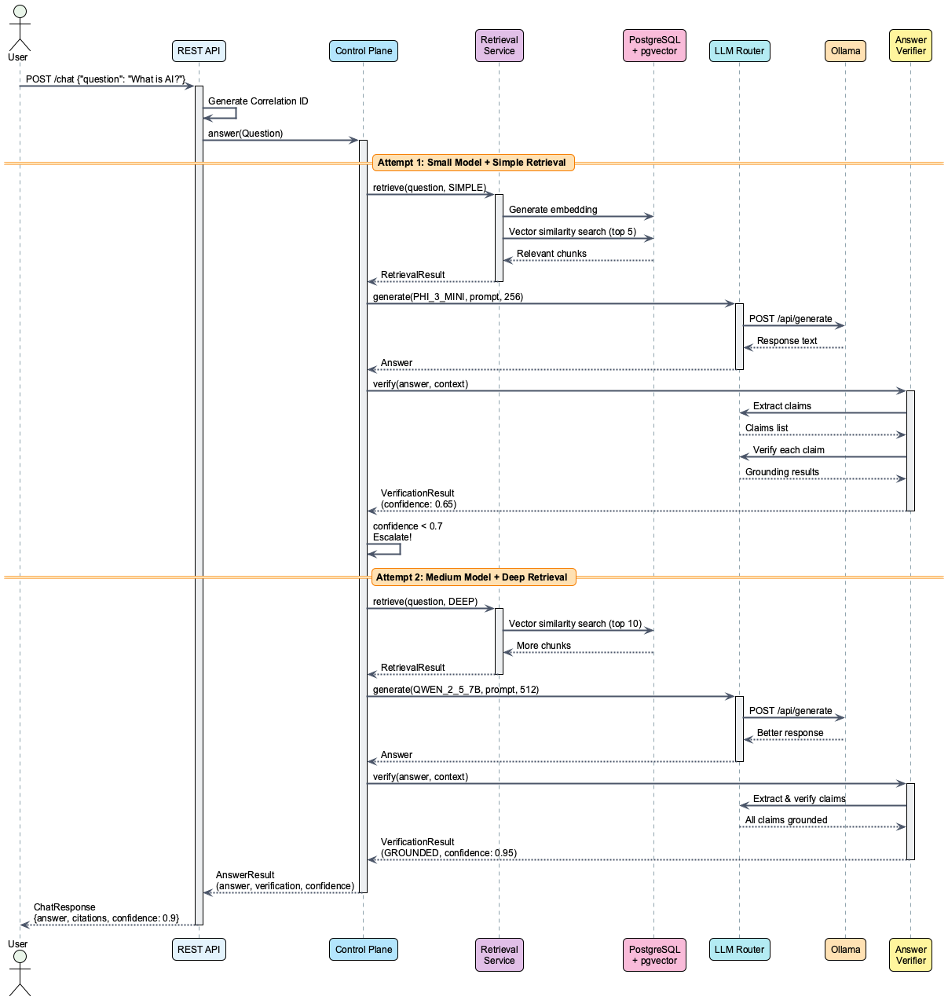

# AI Control Plane

**Enterprise-grade, agentic RAG control plane using only open-source AI models**

[](https://github.com/ksktechai/ai-control-plane/actions)
[](https://openjdk.org/projects/jdk/21/)
[](https://spring.io/projects/spring-boot)

## Overview

AI Control Plane is a production-ready RAG (Retrieval-Augmented Generation) system that:

- **Uses ONLY open-source AI models** (no OpenAI, Anthropic, or proprietary APIs)
- **Runs completely offline** with Ollama for local LLM inference
- **Automatically verifies answer grounding** and retries with better models when needed
- **Provides full observability** with correlation IDs, structured logging, and confidence scores
- **Scales intelligently** from small to large models based on question complexity

## Architecture



### Design Philosophy

This project uses a **single-module Gradle build with package-based organization** instead of a multi-module setup. This approach provides:

- **Simpler build configuration** - One `build.gradle` instead of managing inter-module dependencies
- **Faster builds** - No module dependency resolution overhead
- **Easier navigation** - All code in one source tree
- **Cleaner separation** - Package boundaries enforce architectural layers without build complexity

The architecture maintains clean separation through packages rather than physical modules.

### Key Components

| Component | Purpose | Package |
|-----------|---------|---------|
| **API** | REST endpoint with request/response logging | `com.ai.api` |
| **Control Plane** | Orchestration engine with intelligent retry logic | `com.ai.control` |
| **RAG** | Document chunking, retrieval, and context assembly | `com.ai.rag` |
| **LLM Router** | Abstraction over Ollama-based OSS models | `com.ai.llm` |
| **Embeddings** | Vector generation using nomic-embed-text | `com.ai.embeddings` |
| **Verifier** | Claim extraction and grounding verification | `com.ai.verifier` |
| **Common** | Shared domain models, DTOs, and utilities | `com.ai.common` |

## Features

### 🤖 Open-Source AI Models

Uses state-of-the-art open-source models via Ollama:
- **Llama 3.2 3B, Llama 3.1 8B** - Meta's latest models
- **Qwen 2.5 7B, Qwen 2.5 14B** - Alibaba's powerful reasoning models
- **Phi-3 Mini** - Microsoft's efficient small model
- **DeepSeek R1 1.5B** - Fast inference for simple questions
- **Mistral 7B** - High-quality general-purpose model

### 🔍 Intelligent Retrieval

- **PostgreSQL + pgvector** for fast similarity search
- **Multiple retrieval strategies**: SIMPLE (top 5), DEEP (top 10), EXHAUSTIVE (top 20)
- **Automatic strategy escalation** when answers lack confidence
- **IVFFlat indexing** for efficient vector operations

### ✅ Automatic Grounding Verification

- **Claim extraction** from generated answers
- **Grounding check** against retrieved context
- **Confidence scoring** based on verification results
- **Automatic retry** with larger models when grounding is insufficient

### 📊 Full Observability

- **Correlation ID propagation** via Log4j2 MDC
- **Request/response logging** with sensitive data redaction
- **SQL query logging** with parameter values and timing
- **RAG retrieval logging** with chunk IDs and similarity scores

### 🔄 Intelligent Retry Logic

The control plane automatically escalates when confidence is low:

1. **Attempt 1**: Phi-3 Mini (3.8B) + SIMPLE retrieval
2. **Attempt 2**: Qwen 2.5 7B + DEEP retrieval
3. **Attempt 3**: Qwen 2.5 14B + EXHAUSTIVE retrieval

## Tech Stack

- **Java 21** (latest LTS)
- **Spring Boot 3.4.1**
- **Gradle** (single-module build with package-based organization)
- **PostgreSQL 16** + **pgvector**
- **Ollama** (local LLM runtime)
- **Log4j2** (structured logging with ANSI colors)
- **JUnit 5** + **AssertJ** + **Mockito**
- **JaCoCo** (100% test coverage enforcement)

## Getting Started

### Prerequisites

- **Java 21** (Temurin recommended)
- **Docker** and **Docker Compose** (for PostgreSQL)
- **Ollama** (install from https://ollama.ai)
- **8GB+ RAM** (for running LLMs locally)

### Quick Start

1. **Clone the repository**
   ```bash
   git clone https://github.com/ksktechai/ai-control-plane.git
   cd ai-control-plane
   ```

2. **Start infrastructure**
   ```bash
   ./scripts/start-infra.sh
   ```

   This will:
   - Start PostgreSQL with pgvector extension (Docker container)
   - Check that Ollama is installed and running on your host
   - Pull required models if missing (nomic-embed-text, phi3:mini, qwen2.5:7b)
   - Initialize database schema
   - Create sample documents

   **Note:** Ollama runs as a **host installation**, not in a container. Make sure Ollama is installed and running before starting the infrastructure.

3. **Build the application**
   ```bash
   ./gradlew clean build
   ```

4. **Run the API**
   ```bash
   ./gradlew bootRun
   ```

   API will be available at `http://localhost:8080`

### Check Infrastructure Status

```bash
./scripts/check-infra.sh
```

### Stop Infrastructure

```bash
./scripts/stop-infra.sh
```

## API Usage

### POST /api/chat

Ask a question and get a grounded answer with citations.

**Request:**
```bash
curl -X POST http://localhost:8080/api/chat \
  -H "Content-Type: application/json" \
  -d '{
    "question": "What is artificial intelligence?"
  }'
```

**Response:**
```json
{
  "answer": "Artificial Intelligence (AI) is the simulation of human intelligence by machines. It includes machine learning, natural language processing, and computer vision.",
  "citations": [
    {
      "chunkId": "chunk-sample-1",
      "documentId": "doc-sample-1",
      "text": "Artificial Intelligence (AI) is the simulation of human intelligence by machines.",
      "relevanceScore": 0.9
    }
  ],
  "confidence": 0.95,
  "modelUsed": "phi3:mini",
  "retrievalStrategy": "SIMPLE",
  "verificationStatus": "GROUNDED"
}
```

### GET /api/health

Check API health status.

```bash
curl http://localhost:8080/api/health
```

## How It Works

### Request Flow



1. **User sends question** via REST API
2. **Control plane retrieves context** from PostgreSQL using vector similarity
3. **LLM generates answer** based on retrieved context
4. **Verifier checks grounding** by extracting and validating claims
5. **If confidence is low**, escalate to larger model and retry
6. **Return answer** with citations, confidence score, and verification status

### Model Selection Strategy

| Complexity | Model | Parameters | Context Window |
|------------|-------|------------|----------------|
| Simple | Phi-3 Mini | 3.8B | 4K |
| Medium | Qwen 2.5 7B | 7B | 32K |
| Complex | Qwen 2.5 14B | 14B | 32K |

### Retrieval Strategies

| Strategy | Top-K | Use Case |
|----------|-------|----------|
| SIMPLE | 5 | Quick factual questions |
| DEEP | 10 | Multi-faceted questions |
| EXHAUSTIVE | 20 | Complex analytical questions |

## Development

### Running Tests

```bash
./gradlew test
```

### Test Coverage Report

```bash
./gradlew jacocoTestReport
open build/reports/jacoco/test/html/index.html
```

### Generate Documentation Diagrams

```bash
./gradlew docs
```

Diagrams will be generated in `docs/images/` from sources in `docs/diagrams/`.

### Project Structure

```
ai-control-plane/
├── src/
│   ├── main/java/com/ai/
│   │   ├── api/              # REST API layer (controllers, filters)
│   │   ├── common/           # Shared domain models, DTOs, utilities
│   │   ├── control/          # Orchestration engine with retry logic
│   │   ├── embeddings/       # Vector embedding generation (Ollama)
│   │   ├── llm/              # LLM abstraction layer (Ollama client)
│   │   ├── rag/              # Retrieval-augmented generation
│   │   └── verifier/         # Answer grounding verification
│   ├── main/resources/
│   │   └── application.yml   # Application configuration
│   └── test/java/com/ai/     # Unit tests (100% coverage)
├── docker/                   # Docker configuration files
│   └── postgres/             # PostgreSQL initialization scripts
├── docs/                     # Documentation and diagrams
│   ├── diagrams/             # Mermaid and PlantUML sources
│   └── images/               # Generated diagram images
├── scripts/                  # Helper scripts for infrastructure
├── build.gradle              # Gradle build configuration
└── settings.gradle           # Gradle settings
```

## Configuration

### Application Configuration

Edit `src/main/resources/application.yml`:

```yaml
server:
  port: 8080

spring:
  datasource:
    url: jdbc:postgresql://localhost:5432/aidb
    username: aiuser
    password: aipass

ollama:
  base-url: http://localhost:11434

embedding:
  ollama-base-url: http://localhost:11434
  model: nomic-embed-text

logging:
  pattern:
    console: "%d{yyyy-MM-dd HH:mm:ss.SSS} %highlight{%-5p} %style{%pid}{magenta} --- [%15.15t] %style{[%X{correlationId}]}{yellow} %style{%-40.40logger{39}}{cyan} : %m%n"
```

### Logging Features

- **Correlation ID tracking** - Unique ID per request (auto-generated or from `X-Correlation-Id` header)
- **Colored console output** - Log4j2 with ANSI color codes for better readability
- **Request/Response logging** - Complete API request/response bodies with timing
- **SQL query logging** - All database queries with parameters and execution time
- **RAG retrieval logging** - Embedding generation, similarity search, and chunk retrieval

## Performance

- **Simple questions**: ~2-3 seconds (Phi-3 Mini)
- **Medium questions**: ~5-7 seconds (Qwen 2.5 7B)
- **Complex questions**: ~10-15 seconds (Qwen 2.5 14B with retries)

*Performance depends on hardware. Tested on M1 Mac with 16GB RAM.*

## CI/CD

GitHub Actions workflow automatically:
- Builds all modules
- Runs all tests
- Generates coverage reports
- Builds documentation diagrams

See `.github/workflows/ci.yml` for details.

## Project Status

**Current Version:** 1.0.0-SNAPSHOT

All core features implemented and tested:
- ✅ Single-module Gradle build with package-based organization
- ✅ Clean architecture with 7 functional packages
- ✅ Comprehensive test suite with 100% coverage (JaCoCo enforced)
- ✅ Docker Compose infrastructure
- ✅ PostgreSQL + pgvector integration
- ✅ Ollama LLM integration
- ✅ Full logging and observability with correlation IDs
- ✅ Request/response filters with colored Log4j2 output
- ✅ GitHub Actions CI/CD

## License

This project is licensed under the MIT License.

## Contributing

Contributions are welcome! Please read our contributing guidelines before submitting PRs.

## Diagram Sources

- [Architecture Diagram Source](docs/diagrams/architecture.mmd) (Mermaid)
- [Sequence Diagram Source](docs/diagrams/sequence.puml) (PlantUML)

## Resources

- [Ollama Documentation](https://github.com/ollama/ollama)
- [pgvector Documentation](https://github.com/pgvector/pgvector)
- [Spring Boot Reference](https://docs.spring.io/spring-boot/docs/current/reference/html/)
- [Gradle User Guide](https://docs.gradle.org/current/userguide/userguide.html)

---

**Built with ❤️ using only open-source technologies**
